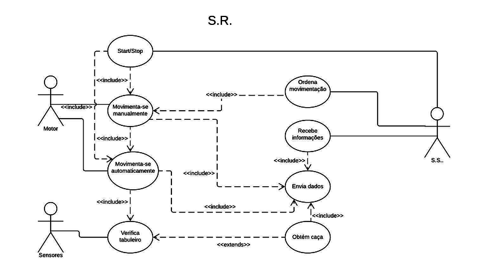
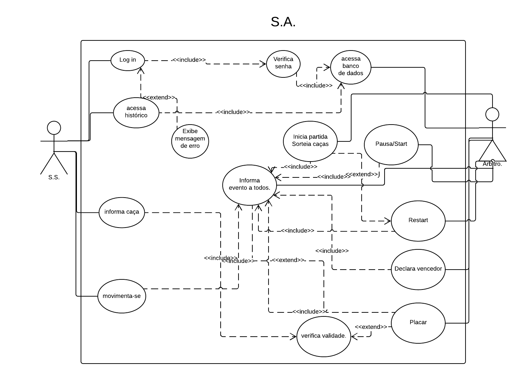
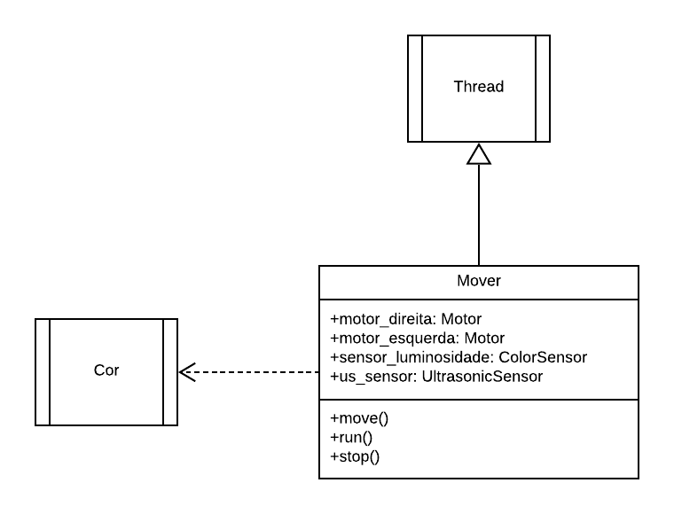

# Projeto Integrador 2 
#### Suyan Moriel e Yara Karoline

Diagrama de caso de uso do S.S.:

 
 ### Diagrama de caso de uso do S.S.:
 

Diagrama de caso de uso do S.R.:

 
 ### Diagrama de caso de uso do S.R.:
 
 

Diagrama de caso de uso do S.A.:

### Diagrama de caso de uso do S.A.:

 

Diagrama de clase(Mover):

### Diagrama de Classe (Mover):

## Casos de Uso:

Casos de uso do S.A.:

 
### Caso de uso S.A.:
##### Nome: Verifica tabuleiro
* Identificador: CSU.SA 01
* Sumário: Inicia a conexão entre S.A S.S
* Ator primário: S.S

###### Fluxo principal:

1. S.S envia ao S.A uma mensagem contendo o nome do robô, cor e senha. 

2. S.A válida os dados ou não.

###### Fluxo de exceções: 

1. Senha errada o Login errado:

2. Simplesmente envia uma mensagem ao S.S informando-o que não foi possível conectar devido a login e/ou senha errado(s)

##### Nome: Acessa histórico
* Identificador: CSU.SA 02
* Sumário: Envia histórico de partidas ao cliente. 
* Ator primário: S.A.
* Précondições: CSU.SA 01

###### Fluxo principal:	
1. S.S. solicita histórico de partidas ao S.A. 

2. S.A procura em seu banco de dados o histórico daquele cliente 
Caso tenha algo, envia o histórico, caso contrário informa que não há histórico.  

##### Nome: Inicia partida. 
* Identificador: CSU.SA 03
* Sumário: Inicia a partida, sorteando as caças e informando aos robôs suas posições
* Ator primário: S.A

###### Fluxo principal:	
1. Gera as posições das caças 
 
2. Informa a todos as posições das caças. 

3. Espera ack de todos para iniciar de fato.

###### Fluxo de exeção
* Não recebeu ack de todos os robôs: Envia posições novamente 

##### Nome: Valida caça. 
* Identificador: CSU.SA 04
* Sumário: Válida ou não a caça de um robô 
* Ator primário: SA.
* A partida ter começado (CSU.SA 03)

###### Fluxo principal:	

1. Recebe mensagem de caça obtida de algum determinado S.S

2. S.A verifica se realmente aquela caça é válida ou não

3. Caso seja validada, incrementa o placar e atualiza as caças, informado aos outros S.S.

##### Nome: Recebe informações dos robôs. 
* Identificador: CSU.SA 05
* Sumário: Recebe dados de movimentação dos robôs.
* Précondições: CSU.SA 03
* Ator primário: S.A.

###### Fluxo principal:	

1. S.S informa a posição de seu respectivo robô ao S.A 

2. S.A processa a informação 

3. S.A informa ao S.S a posição de outros robôs para evitar colisões. 

##### Nome: Declara vencedor
* Identificador: CSU.SA 06
* Sumário: Finaliza uma partida declarando o vencedor. 
* Ator primário: S.A. 
* Précondições: CSU.SA 03

###### Fluxo principal: 

1. Calcula a pontuação 

2. Informa a pontuação aos jogadores. 

3. Salva histórico de partida.

##### Nome: Pausa
* Identificador: CSU.SA 07
* Sumário: Pausa a partida caso o árbitro decida.
* Ator primário: S.A. 
* Précondições: CSU.SA 03
###### Fluxo principal: 

1. Envia mensagem de pause para os S.S.

2. Espera ACK

3. Uma vez todos os ACKs recebido, aguarda o recomeço da partida. 

4. Recomeça a partida de onde fora pausada. 

Diagrama de caso de uso do S.S.:

 
### Caso de uso S.S.:
 
 

 

 
 
 

Diagrama de caso de uso do S.R.:

 
### Caso de uso S.R.:

 

 

Requisitos funcionais.:

 
## Requisitos funcionais:
RF01 O sistema deve permitir criação e gerência de cadastro de um robô.

RF02 O sistema de deve manter um histórico das partidas realizadas.

RF03 O sistema deve ser capaz de fazer a autenticação dos robôs cadastrados.

RF04 os robôs devem ser capazes de operar nos modos manual e autônomo.

RF05 O sistema deve validar e contabilizar as caças já encontradas pelo robô.

RF06 O sistema deve dar início a partida, sortear os locais das caças e informá-los aos robôs.

RF07 O sistema deve prover uma interface de monitoramento para o robô em modo autônomo.

RF08 O sistema deve prover uma interface de controle e monitoramento para os robôs em modo manual.

RF09 O sistema deve permitir que, quando em modo autônomo, o robô execute os movimentos programados a partir do algoritmo implementado.

RF010 O sistema deve permitir pausa e reset da partida.

RF011 O sistema deve permitir que os resultados do jogo sejam vistos pelos espectadores em tempo real.

RF012 O sistema não deve permitir que os robôs se choquem.

RF013 O sistema deve declarar um vencedor assim que todas as caças forem encontradas.

RF014 O sistema pode ter N competidores *

RF015 O sistema deve projetar informações no tabuleiro (Caças ativas, Caças encontradas, e placar) 

 

 

